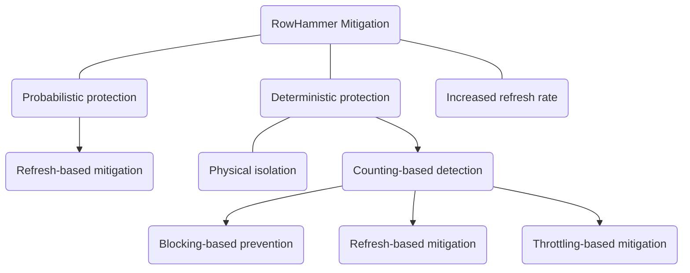
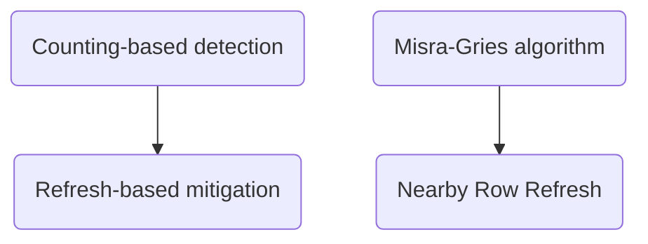
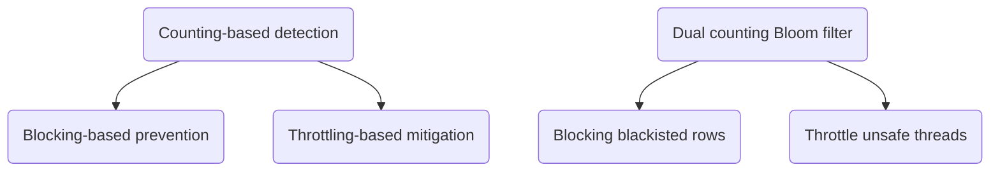

# Haowen Liu (2021-3-28)

# Paper information
- Title: BlockHammer: Preventing RowHammer at Low Cost by Blacklisting Rapidly-Accessed DRAM Rows
- Authors: Abdullah Giray Yağlıkçı, Minesh Patel, Jeremie S. Kim, Roknoddin Azizi, Ataberk Olgun, Lois Orosa, Hasan Hassan, Jisung Park, Konstantinos Kanellopoulos, Taha Shahroodi, Saugata Ghose, Onur Mutlu
- Venue: HPCA 2021
- Keywords: Blocking-based RowHammer prevention, throttling-based RowHammer mitigation, Bloom filter, memory controller

# Paper content
## Summary
This paper first uses a *dual counting Bloom filter* (a space-efficient hash data structure to count the upper bounds of occurrence frequencies of elements in an incoming data stream, playing the same role as *Misra-Gries algorithm* in *Graphene*. Introduced in Takeaways part in detail) to track the number of activations on DRAM rows to blacklist aggressor rows without false negatives, and then delays unsafe activations (subsequent activations to blacklisted rows) by per-DRAM-rank FIFO history buffers (namely, blocking blacklisted rows). To mitigate the system-wide performance degradation that a RowHammer attack could inflict upon benign applications, the authors throttle the memory bandwidth utilization of potential RowHammer threads by applying a dynamic quota, which leverages the inherent feature of RowHammer threads that they attempt to issue more activations to a blacklisted row than a benign application would. They propose the *RowHammer likelihood index* (*RHLI*) of a <thread, bank> pair (which is proportional to the number of the thread's activations on the blacklisted rows), and then apply the bandwidth quota inversely proportional to the *RHLI* (namely, the quota of a certain thread is proportional to the number of this thread's activations on blacklisted rows).

Their simulation experiments on two types of multiprogrammed workloads — 1) 8 benign applications; 2) 1 RowHammer attack application and 7 benign applications — were carried out on BlockHammer and other six state-of-the-art RowHammer mitigation mechanisms to evaluate the performance, energy overheads, and scalability with worsening RowHammer vulnerability. The results show that with negligible false positive rate and penalty, BlockHammer 1) introduces very low performance and DRAM energy overheads for workloads with no RowHammer attack present; 2) scalably provides much higher benign application performance and lower DRAM energy consumption than all state-of-the-art mechanisms when a RowHammer attack is present.

Finally, the paper proposes four desired characteristics of a RowHammer mitigation mechanism: comprehensive protection, compatibility with commodity DRAM chips, scaling with RowHammer vulnerability, and deterministic protection. So far, BlockHammer is the only mechanism providing all the four characteristics. This paper also discusses the scenario that BlockHammer faces many-sided RowHammer attacks by modifying the blacklisting threshold.

## Strengths
- Implementing the blacklist on the memory controller to directly prevent the malicious application from activating the DRAM rows guarantees comprehensive protection.
- The idea is innovative and effective. Proactively blocking the potential aggressor rows instead of reactively refreshing potential victim rows allows the defender to require no proprietary DRAM information (e.g., mapping) and modifications to DRAM chip design, namely, compatibility with commodity DRAM chips. And blocking the potential aggressor rows will not take up the time of normal memory requests, so it has little influence on benign applications.
- Another innovation is designing the AttackThrottler to throttle the memory bandwidth utilization of RowHammer applications, which frees up additional memory bandwidth for concurrently-running benign threads. This strategy not only mitigates the system-wide performance degradation that a RowHammer attack could inflict upon benign applications, but also gives BlockHammer significant advantage in scalability with worsening RowHammer vulnerability, because the throttler limits the RowHammer threads directly, which instead increases the efficiency of benign applications.
- The evaluation experiments consider other six state-of-the-art RowHammer mitigation mechanisms, showing the effectiveness of the method.
- The authors prove that no RowHammer attack can defeat BlockHammer using the *proof by contradiction* method.

## Weaknesses
- The authors did not give us the way to schedule the DRAM commands after delaying unsafe activations. Besides `active`, there are many other kind of DRAM commands, and several dependent DRAM commands constitute a CPU memory request. The paper did not indicate that how to buffer other DRAM commands of the same CPU memory request when the activation of this memory request is delayed.
- To reduce the time overhead, BlockHammer implements the *dual counting Bloom filter* on a relatively large piece of SRAM, significantly increasing the cost. Compared with *Graphene*, although *dual counting Bloom filter* and *Misra-Gries algorithm* have the same function of detecting aggressor rows and maintaining blacklist, the former is less space-efficient than the latter for it retains more count information that is not necessary for RowHammer detection (theoretically, the former maintains upper bounds of occurrence frequencies of all rows in DRAM, but the latter only maintains the most frequent rows’ occurrence frequencies, so the latter is more space-efficient, which is also shown in experiments).
- BlockHammer can be separated to two parts: the blocking-based prevention and the throttling-based mitigation, and they have very different characteristics, so BlockHammer cannot be only categorized to a throttling-based RowHammer prevention as the authors did, which misleads readers' understanding of the idea.
- The AttackThrottler has an apparent defect that when facing multi-thread RowHammer attacks, it will lose its effect to mitigate the performance degradation by RowHammer attack as well as its advantage in scalability with worsening RowHammer vulnerability, because its throttling mechanism is based on the behavior of single thread and will be ineffective when facing multi-thread or even multi-process RowHammer attacks.
- Unlike refresh-based mitigation, blocking- and throttling-based prevention mechanisms like BlockHammer require no proprietary DRAM information, but they generate another vulnerability: Denial-of-Service (DoS). The inherence of blocking- and throttling-based prevention gives attackers the chance to manipulate the mechanism to block benign applications and DRAM rows. For example, an attacker can use some strategy to misguide BlockHammer to mistakenly block benign applications. Though I cannot figure out a clear strategy to exploit this vulnerability now, as far as it exists there, there is a risk.

## Thoughts
- Blocking-based prevention vs. Refresh-based mitigation: 
  - Pros: 
    - Blocking-based prevention requires no proprietary DRAM information. It just blocks the aggressor rows, so it achieves better compatibility with commodity DRAM chips. But refresh-based mitigation requires the information like address mapping to address victim rows.
    - Blocking-based prevention has little influence on benign applications, because it just blocks blacklisted rows and will not affect normal memory requests. But refresh-based mitigation has to refresh victim rows, which will take up the time of normal memory requests and cause delays, which is especially severe when RowHammer vulnerability is worsening.
  - Cons: 
    - Blocking-based prevention needs a large area and new mechanisms to buffer and reschedule the delayed commands, but the refresh-based mitigation just refreshes the victim rows, requiring no extra area.
    - Blocking-based prevention gives attackers the chance to block benign applications and DRAM rows (DoS), but the refresh-based mitigation does not affect the execution of either benign applications or RowHammer attack applications.
- Throttling-based mitigation can be combined with either blocking-based prevention or refresh-based mitigation. Throttling-based mitigation mitigates the performance degradation by RowHammer attack and provides advantage in scalability with worsening RowHammer vulnerability. The inherent weakness of throttling-based mitigation is that it cannot achieve comprehensive protection because it operates at the operating system level. Therefore it can only be used as a supplement to comprehensive protection.
- A comprehensive protection requires the mitigation mechanism directly operated on row activations.
- Both *Graphene* and *BlockHammer* indicate a new direction to detect RowHammer attacks with zero false negatives: use a space-efficient (accuracy-for-space/time) counting algorithm to detect RowHammer attacks with **no false negative** and small false positives.

The common framework of RowHammer mitigation:

Give *Graphene* as an example:

Give *BlockHammer* as another example:

## Takeaways and questions
This paper classifies RowHammer mitigation mechanisms into four high-level approaches: increased refresh rate, physical isolation, reactive refresh, and proactive throttling, and proposes four desired characteristics: comprehensive protection, compatibility with commodity DRAM chips, scaling with RowHammer vulnerability, and deterministic protection, which can be a good reference and standard for our subsequent research.

A ***Bloom filter*** is a space-efficient probabilistic data structure that is used to test whether an element is a member of a set (*membership query*). False positive matches are possible, but false negatives are not --- in other words, a query returns either "possibly in set" or "definitely not in set”. An *empty Bloom filter* is a bit array of *m* bits, all set to 0. There must also be *k* different hash functions defined, each of which maps or hashes some set element to one of the *m* array positions, generating a uniform random distribution. Typically, *k* is a small constant which depends on the desired false error rate *ε*, while *m* is proportional to *k* and the number of elements to be added. To *add* an element, feed it to each of the *k* hash functions to get *k* array positions. Set the bits at all these positions to 1. To *query* for an element (test whether it is in the set), feed it to each of the *k* hash functions to get *k* array positions. If *any* of the bits at these positions is 0, the element is definitely not in the set; if it were, then all the bits would have been set to 1 when it was inserted. If all are 1, then either the element is in the set, *or* the bits have by chance been set to 1 during the insertion of other elements, resulting in a false positive. A *Bloom filter* can test whether an element is in a set with zero false negatives and certain false positives, and require much less area and time than the total footprint of the set itself (most of other data structures require storing at least the data items in the set themselves), which is a typical ***accuracy-for-space/time*** method.

Once a set has been converted to a *Bloom filter*, we can only add elements into it but cannot delete any element from it, because two different elements can have the same set of hash positions. But the ***Counting Bloom Filter (CBF)*** solves this problem. CBF is also used in *membership query*. In a CBF, the array positions (buckets) are extended from being a single bit to being a multi-bit counter. The mechanism of CBF is similar to *Bloom filter*, but since the array positions are extended to multi-bit counters, the insert operation is extended to *increment* the value of the buckets, and the lookup operation checks that each of the required buckets is non-zero. The delete operation then consists of decrementing the value of each of the respective buckets. Obviously, a CBF can be also used to query the upper bounds of occurrence frequencies of elements in a set (*frequency query*) by returning the *minimum* value among all of the element’s corresponding counters. However, since in the worst case the frequency of uncertain elements can be very big, the size of all counters should be big enough, which significantly decreases its space-efficiency (the reason why *BlockHammer* is less space-efficient than *Graphene*). The ***Spectral Bloom Filter*** and ***Dynamic Count Filter*** solve this problem. But as they did not appear in this paper, I will not introduce them here.

Another defect of *Bloom filter* is that a *Bloom filter* eventually saturates (i.e., always returns true when tested for any element) if elements are continually inserted, which requires periodically clearing the filter and losing all inserted elements. ***Unified Bloom Filter (UBF)*** is a *Bloom filter* variant that allows a system to continuously track a set of elements that are inserted into a *Bloom filter* within the most recent time window of a fixed length (i.e., a *rolling time window*). Using a conventional *Bloom filter* to track a rolling time window could result in data loss whenever the *Bloom filter* is cleared, as the clearing eliminates the elements that still fall within the rolling time window. Instead, UBF continuously tracks insertions in a rolling time window by maintaining *two* Bloom filters and using them in a time-interleaved manner. UBF inserts every element into both filters, while the filters take turns in responding to *test* queries across consecutive limited time windows (i.e., *epochs*). UBF clears the filter which responds to *test* queries at the end of an epoch and redirects the *test* queries to the other filter for the next epoch. Therefore, each filter is cleared every other epoch (i.e., the filter’s lifetime is two epochs). By doing so, UBF ensures no false negatives for the elements that are inserted in a *rolling time window* of up to two epochs.

The ***dual counting Bloom filter (D-CBF)*** in this paper is the combination of ***Unified Bloom Filter (UBF)*** and ***Counting Bloom Filter (CBF)***. D-CBF maintains *two* CBFs in the time-interleaved manner of UBF to track the upper bounds of occurrence frequencies of rows in the memory requests in a *rolling time window* (i.e., rolling refresh intervals, because the rows in a bank are not refreshed simultaneously, but one by one in rolling refresh intervals).
