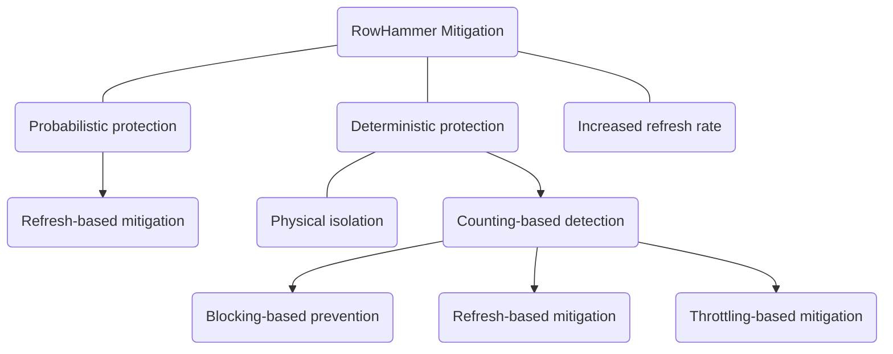
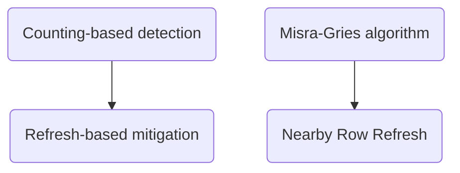
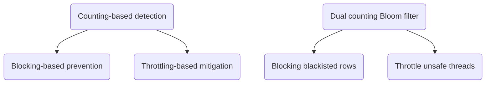

# Haowen Liu (2021-3-28)

# Paper information

- Title: BlockHammer: Preventing RowHammer at Low Cost by Blacklisting Rapidly-Accessed DRAM Rows
- Authors: Abdullah Giray Yağlıkçı, Minesh Patel, Jeremie S. Kim, Roknoddin Azizi, Ataberk Olgun, Lois Orosa, Hasan Hassan, Jisung Park, Konstantinos Kanellopoulos, Taha Shahroodi, Saugata Ghose, Onur Mutlu
- Venue: HPCA 2021
- Keywords: Blocking-based RowHammer prevention, throttling-based RowHammer mitigation, Bloom filter, memory controller

# Paper content

## Summary

This paper proposes to detect and prevent RowHammer attacks by first using a *dual counting Bloom filter* (a space-efficient hash data structure to count the upper bound of occurrence number of certain elements in an incoming data stream, having the same function as *Misra-Gries algorithm* of *Graphene*. Introduced in Takeaways part in detail) to track the number of activations on DRAM rows to blacklist aggressor rows without false negative, and then delaying unsafe activations (subsequent activations to blacklisted rows) by per-DRAM-rank FIFO history buffers (namely, blocking blacklisted rows). To mitigate the system-wide performance degradation that a RowHammer attack could inflict upon benign applications, the authors throttle the memory bandwidth utilization of potential RowHammer attack threads by applying a dynamic quota, which leverages the inherent feature of RowHammer attack threads that they attempt to issue more activations to a blacklisted row than a benign application would. They propose the *RowHammer likelihood index* (*RHLI*) per bank to quantify the similarity between a given thread’s memory access pattern and a real RowHammer attack (*RHLI* of certain thread is proportional to the number of its activations on the blacklisted rows), and then apply the bandwidth quota inversely proportional to the *RHLI*.

Their simulation experiments on two types of multiprogrammed workloads — 1) 8 benign applications; 2) 1 RowHammer attack application and 7 benign applications — were carried out on BlockHammer and other six state-of-the-art RowHammer mitigation mechanisms to evaluate the performance, energy overheads, and scalability with worsening RowHammer vulnerability. The simulation results show that with negligible false positive rate and penalty, BlockHammer 1) introduces very low performance and DRAM energy overheads for workloads with no RowHammer attack present; 2) scalably provides much higher benign application performance and lower DRAM energy consumption than all state-of-the-art mechanisms when a RowHammer attack is present.

Finally, the paper proposes four desired characteristics of a RowHammer mitigation mechanism: comprehensive protection, compatibility with commodity DRAM chips, scaling with RowHammer vulnerability, and deterministic protection. So far, BlockHammer is the only mechanism providing all the four characteristics. This paper also discusses the scenario that BlockHammer faces many-sided RowHammer attacks by modifying the blacklisting threshold.

## Strengths

- Implementing the blacklist on the memory controller to directly prevent the malicious application from activating the DRAM rows guarantees comprehensive protection.
- The idea is innovative and effective. Proactively blocking the potential aggressor rows instead of reactively refreshing potential victim rows allows the defender to require no proprietary DRAM information (e.g., mapping) and modifications to DRAM chip design, namely, compatibility with commodity DRAM chips.
- Another innovation is designing the AttackThrottler to throttle the memory bandwidth utilization of RowHammer attack applications, freeing up additional memory bandwidth for concurrently-running benign threads. This strategy not only mitigates the system-wide performance degradation that a RowHammer attack could inflict upon benign applications, but also gives BlockHammer significant advantage in scalability with worsening RowHammer vulnerability, because the throttler limits the RowHammer threads directly, which fundamentally solves the problem.
- The evaluation experiments consider other six state-of-the-art RowHammer mitigation mechanisms, showing the effectiveness of the method.
- The authors prove that no RowHammer attack can defeat BlockHammer using the *proof by contradiction* method.

## Weaknesses

- Delaying activations is not that simple. The authors did not give us the way to schedule the DRAM commands after delaying unsafe activations. Besides `active`, there are many other kind of DRAM commands, and several dependent DRAM commands constitute a CPU memory request. The paper did not indicate that how to buffer other DRAM commands of the same CPU memory request when the activation of this memory request is delayed.
- To reduce the time overhead, BlockHammer implements the *dual counting Bloom filter* on a relatively large piece of SRAM, significantly increasing the cost. Compared with *Graphene*, although *dual counting Bloom filter* and *Misra-Gries algorithm* have the same function of detecting aggressor rows and maintaining blacklist, the former is less space-efficient than the latter for it retains more count information that is not necessary for RowHammer detection.
- BlockHammer can be separated to two parts: the blocking-based prevention and the throttling-based mitigation, and they have very different characteristics, so BlockHammer cannot be only categorized to a throttling-based RowHammer prevention as the authors did, which interferes with the reader's understanding of the idea.
- The AttackThrottler has an apparent defect that it will lose its effect to mitigate the performance degradation by RowHammer attack as well as its advantage in scalability with worsening RowHammer vulnerability when facing multi-thread RowHammer attacks, because its throttling mechanism is based on the behavior of single thread and will be ineffective when facing multi-thread or even multi-process RowHammer attacks.
- Unlike refresh-based mitigation, blocking- and throttling-based prevention mechanisms like BlockHammer require no proprietary DRAM information, but they generate another vulnerability: Deny-of-Service (DoS). The inherence of blocking- and throttling-based prevention gives attackers the chance to manipulate the mechanism to block benign applications and DRAM rows. Though I cannot figure out how to exploit this vulnerability now, as far as it exists there, there is a risk.

## Thoughts
- Blocking-based prevention vs. Refresh-based mitigation: 
  - Pros: Blocking-based prevention requires no proprietary DRAM information. It just blocks the aggressor rows, so it achieves better compatibility with commodity DRAM chips. But refresh-based mitigation requires the information like address mapping to address victim rows.
  - Cons: 
    - Blocking-based prevention needs a large area and new mechanisms to buffer and reschedule the delayed commands, but the refresh-based mitigation just refreshes the victim rows, requiring no extra area.
    - Blocking-based prevention gives attackers the chance to block benign applications and DRAM rows (DoS), but the refresh-based mitigation does not affect the execution of either benign applications or RowHammer attack applications.
- Throttling-based mitigation can be combined with either blocking-based prevention or refresh-based mitigation. Throttling-based mitigation mitigates the performance degradation by RowHammer attack and provides advantage in scalability with worsening RowHammer vulnerability.
- Both *Graphene* and *BlockHammer* indicate a new direction to prevent RowHammer attacks with zero false negative: use a space-efficient (accuracy-for-space) counting algorithm (Misra-Gries algorithm in *Graphene* and Bloom filter in *BlockHammer*) to detect RowHammer attacks with **no false negative** and small false positives, and then use 
- A comprehensive protection needs the mitigation mechanism directly operated on row activations.

## Takeaways and questions

This paper classifies RowHammer mitigation mechanisms into four high-level approaches: increased refresh rate, physical isolation, reactive refresh, and proactive throttling, and proposes four desired characteristics: comprehensive protection, compatibility with commodity DRAM chips, scaling with RowHammer vulnerability, and deterministic protection, which can be a good reference and standard for our subsequent research.

The common framework of RowHammer mitigation:

Give *Graphene* as an example:

Give *BlockHammer* as another example:

Since both *Misra-Gries algorithm* and *dual counting Bloom filter* have the same function of detecting aggressor rows and maintaining blacklist (counting-based detection), the *Misra-Gries algorithm* part of *Graphene* can be replaced by *dual counting Bloom filter*, which will not affect the effectiveness of *Graphene*. And we can also replace the *Nearby Row Refresh* of *Graphene* with *blocking blacklisted rows*, which will convert the *Graphene* into a blocking-based prevention mechanism. In a word, counting-based detection can be implemented with many different data structures and algorithms, but it is just the preparation work. What matters most is the subsequent operation on the elements in the blacklist, namely, blocking, refreshing, or throttling.

