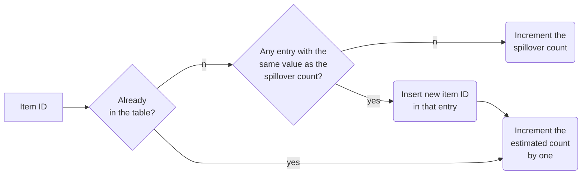

# Haowen Liu (2021-01-04)

# Paper information

- Title: Graphene: Strong yet Lightweight Row Hammer Protection
- Authors: Yeonhong Park, Woosuk Kwon, Eojin Lee, Tae Jun Ham, Jung Ho Ahn, Jae W. Lee
- Venue: MICRO 2020
- Keywords: counter-based RowHammer prevention, Misra-Gries algorithm, memory controller, non-adjacent RowHammer

# Paper content

## Summary

This paper proposes a low-cost counter-based RowHammer prevention called Graphene (strong yet lightweight as Graphene, an atomic-scale hexagonal lattice made of carbon atoms) on the basis of Misra-Gries algorithm, a classic, space-efficient solution to identify frequent elements from an incoming data stream. Graphene is deployed inside a memory controller, using CAM-based tables, with **low area** and performance/energy overhead even for the most adversarial pattern. Due to the basis of Misra-Gries algorithm, Graphene provides protection guarantees with **no false negative** and small false positives, while requiring only a minor extension to the DRAM protocol.

First, this paper divides existing RowHammer solutions into two major categories: probabilistic and counter-based schemes, and analyzes the strengths and weaknesses of them. For probabilistic solutions, they have an advantage in hardware cost for their simplicity, but they do not provide guaranteed protection and hence are prone to false negatives. For counter-based schemes, they usually can provide guaranteed protection with no false negatives, but they are often vulnerable to specific access patterns due to their defective mechanisms, and what’s more, they have a significant cost in terms of either energy and performance (CBT) or area (TWiCe) for tracking ACT counts.

To provide guaranteed protection while addressing those weaknesses in existing schemes, they develop Graphene to detect a potential Row Hammer attack by utilizing the Misra-Gries algorithm (introduced in Takeaways part). To apply Misra-Gries algorithm to aggressor tracking, Graphene configures $T$ (estimated count threshold of Misra-Gries algorithm, which should specifically satisfy the inequality $T<\frac{T_{RH}}{4}+1$ in Graphene, where $T_{RH}$ is the RowHammer threshold of a specific DRAM chip) and $N_{entry}$ (number of entries (estimated count counters) in Misra-Gries algorithm, also should satisfy an inequality $N_{entry}>\frac{W}{T}-1$, where $W$ is the number of items in the data stream). After these configuring, they provide a formal proof of protection guarantees (with no false negative). Then they discuss how Graphene can be extended to handle **non-adjacent rows** from RowHammer, which has not received much attention in most existing proposals. Graphene calculates the estimated count threshold $T$ as a function of charge disturbance accumulation and derives the configuring inequality of non-adjacent scenario $T<\frac{T_{RH}}{4(1+\mu_1+\mu_2+\cdot\cdot\cdot+\mu_n)}+1$, where $\mu_i$ is the coefficient representing the degree of charge disturbance from aggressor rows which are $i$ rows away from the victim row.

Finally, they deploy Graphene inside a memory controller and add a new command `Nearby Row Refresh (NRR)` to the DRAM protocol.

## Strengths

- 

## Weaknesses

- 

## Thoughts
- 

## Takeaways and questions

***Misra-Gries Algorithm:*** A classic, space-efficient solution to identify frequent elements from an incoming data stream. The Misra-Gries algorithm maintains a finite-sized associative array data structure which has an item ID as the key and the *estimated count* as the corresponding value. We refer to this structure as *counter table*. Note that we differentiate the *estimated count* in each entry of the counter table from the *actual count* of the corresponding item ID. In addition to the counter table, it also maintains a value named spillover count, which is initialized with zero. The flow of Misra-Gries algorithm is shown in the figure below. When an *estimated count* for an entry whose key is row X reaches specific threshold $T$ or a multiple of $T$ (e.g., $2T$, $3T$, ...), we identify row X as a potentially fatal aggressor row that can trigger Row Hammer attacks.

