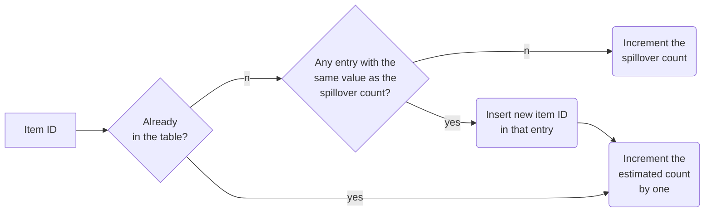

# Haowen Liu (2021-01-04)

# Paper information

- Title: Graphene: Strong yet Lightweight Row Hammer Protection
- Authors: Yeonhong Park, Woosuk Kwon, Eojin Lee, Tae Jun Ham, Jung Ho Ahn, Jae W. Lee
- Venue: MICRO 2020
- Keywords: counter-based RowHammer prevention, Misra-Gries algorithm, memory controller, non-adjacent RowHammer

# Paper content

## Summary

This paper proposes a low-cost counter-based RowHammer prevention called Graphene (strong yet lightweight as Graphene, an atomic-scale hexagonal lattice made of carbon atoms) on the basis of Misra-Gries algorithm, a classic, space-efficient solution to identify frequent elements from an incoming data stream. Graphene is deployed inside a memory controller, using CAM-based tables, with **low area** and performance/energy overhead even for the most adversarial pattern. Due to the basis of Misra-Gries algorithm, Graphene provides protection guarantees with **no false negative** and small false positive, while requiring only a minor extension to the DRAM protocol.

First, this paper divides existing RowHammer solutions into two major categories: probabilistic and counter-based schemes, and analyzes the strengths and weaknesses of them. For probabilistic solutions, they have an advantage in hardware cost for their simplicity, but they do not provide guaranteed protection and hence are prone to false negatives. For counter-based schemes, they usually can provide guaranteed protection with no false negatives, but they are often vulnerable to specific access patterns due to their defective mechanisms, and what’s more, they have a significant cost in terms of either energy and performance (CBT) or area (TWiCe) for tracking ACT counts.

To provide guaranteed protection while addressing those weaknesses in existing schemes, they develop Graphene to detect a potential Row Hammer attack by utilizing the Misra-Gries algorithm (introduced in Takeaways part). 

## Strengths

- 

## Weaknesses

- 

## Thoughts
- 

## Takeaways and questions

***Misra-Gries Algorithm:*** A classic, space-efficient solution to identify frequent elements from an incoming data stream. The Misra-Gries algorithm maintains a finite-sized associative array data structure which has an item ID as the key and the *estimated count* as the corresponding value. We refer to this structure as *counter table*. Note that we differentiate the *estimated count* in each entry of the counter table from the *actual count* of the corresponding item ID. In addition to the counter table, it also maintains a value named spillover count, which is initialized with zero. The process of Misra-Gries algorithm is shown in the figure below.

