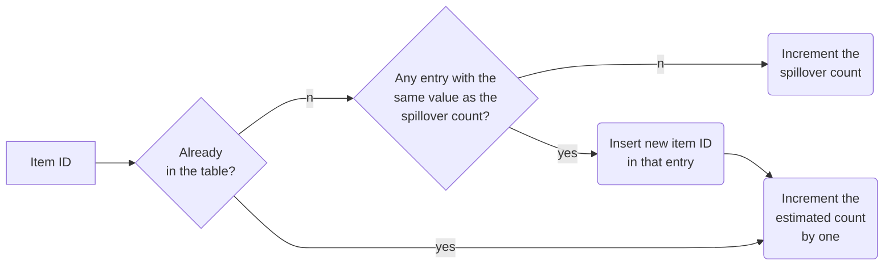

# Haowen Liu (2021-01-04)

# Paper information

- Title: Graphene: Strong yet Lightweight Row Hammer Protection
- Authors: Yeonhong Park, Woosuk Kwon, Eojin Lee, Tae Jun Ham, Jung Ho Ahn, Jae W. Lee
- Venue: MICRO 2020
- Keywords: counter-based RowHammer prevention, Misra-Gries algorithm, memory controller, non-adjacent RowHammer

# Paper content

## Summary

This paper proposes a low-cost counter-based RowHammer prevention called Graphene (strong yet lightweight as Graphene, an atomic-scale hexagonal lattice made of carbon atoms) on the basis of Misra-Gries algorithm, a classic, space-efficient solution to identify frequent elements from an incoming data stream (Frequent Elements Problem). Graphene is deployed inside a memory controller, using CAM-based tables, with **low area** and performance/energy overhead even for the most adversarial pattern. Due to the basis of Misra-Gries algorithm, Graphene provides protection guarantees with **no false negative** and small false positives, while requiring only a minor extension to the DRAM protocol.

First, this paper divides existing RowHammer solutions into two major categories: probabilistic and counter-based schemes, and analyzes the strengths and weaknesses of them. For probabilistic solutions, they have an advantage in hardware cost for their simplicity, but they do not provide guaranteed protection and hence are prone to false negatives. For counter-based schemes, they usually can provide guaranteed protection with no false negatives, but they are often vulnerable to specific access patterns due to their defective mechanisms, and what’s more, they have a significant cost in terms of either energy and performance (CBT) or area (TWiCe) for tracking ACT counts.

To provide guaranteed protection while addressing those weaknesses in existing schemes, they develop Graphene to detect a potential RowHammer attack by utilizing the Misra-Gries algorithm (introduced in Takeaways part). To apply Misra-Gries algorithm to aggressor tracking, Graphene configures $T$ (estimated count threshold of Misra-Gries algorithm) and $N_{entry}$ (the number of entries (estimated count counters) in Misra-Gries algorithm). After these configuring, they provide a formal proof of protection guarantees. Then they discuss how Graphene can be extended to handle **non-adjacent rows** from RowHammer. Graphene calculates the estimated count threshold $T$ as a function of charge disturbance accumulation of $2n$ non-adjacent rows and refreshes these $2n$ rows simultaneously.

Finally, they deploy Graphene inside a memory controller by two CAM arrays and add a new command `Nearby Row Refresh (NRR)` to the DRAM protocol. They evaluate the overhead of Graphene in terms of area, energy, and performance, in comparison to other counter-based schemes and PARA, using both multi-programmed and multi-threaded workloads extracted from each of the 29 SPEC CPU2006 benchmarks, and show that Graphene has the same level of low energy/performance overhead as TWiCE, much lower than PARA and CBT, while having the same level of low area cost as CBT, much lower than TWiCE. And they also evaluate the scalability of Graphene for future DRAM devices having a much lower RowHammer threshold (the number of activations needed to trigger a bit flip) and show that Graphene provides the completely guaranteed protection at the expense of an extra table size, whose actual area cost may not increase much as the technology scales.

## Strengths

- Graphene provides completely guaranteed protection against RowHammer with **no false negative** and the protection guarantee is proved theoretically.
- Graphene shows very small area overhead compared to existing solutions, due to the nature of Misra-Gries algorithm.
- Graphene shows no performance overhead and negligible energy overhead when handling normal workloads.
- They discuss how Graphene can be extended to handle **non-adjacent rows** from RowHammer, which has not received much attention in most existing proposals. And Graphene shows flexibility and scalability to adapt to non-adjacent scenario.
- Good scalability. Graphene provides the completely guaranteed protection at the expense of an extra table size, whose actual area cost may not increase much as the technology scales. And the adjustable reset window allows users to make trade-off between area cost and performance overhead.

## Weaknesses

- Graphene still has substantial **redundancies** as a counter-based RowHammer mitigation mechanism. First, in adjacent scenario, to take both single-row RowHammer and double-row RowHammer into account, Graphene have to reduce the estimated count threshold $T$ by half, which increases the probability of false positives and doubles the number of entries $N_{entry}$ (the number of counters). It is necessary and sufficient if rows in double-row RowHammer are completely independent with each other. Nevertheless, the rows in double-row RowHammer have strong address correlation, so reducing $T$ by half is definitely an overkill. The same problem happens in the non-adjacent scenario.
- On the one hand, the evaluations did not consider the situation when the RowHammer Threshold is very small (less than $1K$). On the other hand, they could not just omit the evaluation of Graphene for normal workloads, after all the false positive of Graphene is not 0, and will be substantial when the RowHammer Threshold is very small.

## Thoughts
- It is vital that the number of activations in a retention interval is limited (for a retention interval of $64ms$, it is $1,360K$), which is the key point to provide completely guaranteed protection in a counter-based scheme. With this limitation, an attacker can only choose limited aggressor rows (the maximum of aggressor rows is $\frac{W}{T_{RH}}$, where $W$ is the max number of activations in a retention interval and $T_{RH}$ is the RowHammer threshold of a certain DRAM chip). So a counter-based protection mechanism can use much less counters to detect aggressor rows with no false negative, rather than tracking every row in a DRAM bank. So a counter-based prevention against RowHammer can be abstracted as the problem to find out the most frequent $N$ items in a certain length of data flow, or to figure out items whose frequency exceed a certain threshold, which is what Graphene does. So other solutions to Frequent Elements Problem like Lossy counting, Space Saving, and Count-Min sketch can be good candidates for counter-based RowHammer mitigation.
- To improve Graphene, one can start with the **redundancies** when configuring $T$ and $N_{entry}$. Graphene simply reduces $T$ by half and doubles $N_{entry}$ to take both single-row RowHammer and double-row RowHammer into account. However, this is low-efficiency because rows in double-row RowHammer have address correlation, using which one can handle both single-row RowHammer and double-row RowHammer without using that big margins as Graphene. Same things happen in non-adjacent scenario.

## Takeaways and questions

***Misra-Gries Algorithm:*** A classic, space-efficient solution to identify frequent elements from an incoming data stream. The Misra-Gries algorithm maintains a finite-sized associative array data structure which has an item ID as the key and the *estimated count* as the corresponding value. We refer to this structure as *counter table*. Note that we differentiate the *estimated count* in each entry of the counter table from the *actual count* of the corresponding item ID. In addition to the counter table, it also maintains a value named spillover count, which is initialized with zero. The flow of Misra-Gries algorithm is shown in the figure below. When an *estimated count* for an entry whose key is row X reaches specific threshold $T$ or a multiple of $T$ (e.g., $2T$, $3T$, ...), we identify row X as a potentially fatal aggressor row that can trigger RowHammer attacks.

The **no false negative** of Graphene is equivalent to the theorem that *The actual count of any row cannot increase by* $T$ *without triggering a victim row refresh.* This theorem is trivial to prove after proving two lemmas: 1) The estimated count of every entry in the counter table is always equal to or greater than the actual count of the corresponding DRAM row; 2) Spillover count cannot exceed $\frac{W}{N_{entry}+1}$. The former can be proved by a strong induction and the latter is obviously correct.

- How do they calculate the energy cost of their implementation in simulation?
- The Misra-Gries algorithm in this paper has a few differences from what I learned before. Are there many variants of Misra-Gries algorithm?