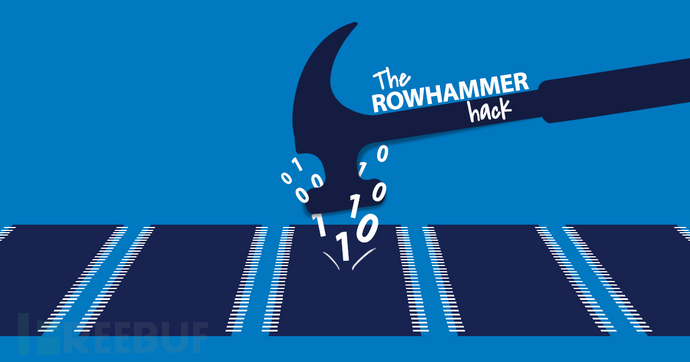

# RowHammer



[TOC]

## Flipping Bits in Memory Without Accessing Them: An Experimental Study of DRAM Disturbance Errors[^1]. 2014 (intensive)

### Note

#### ***Security principle: Memory isolation***

- *Memory isolation is a key property of a reliable and secure computing system — an access to one memory address should **not** have unintended side effects on data stored in other addresses.*
  - a read access should ***not*** modify data at any address
  - a write access should modify data ***only*** at the address being written to

#### ***Reality Reasons***

- *DRAM process technology scales down to smaller dimensions*
  - pros: cost, performance, capacity
    - reducing the cost-per-bit of memory
  - cons: reliability, availability, security
    - a small cell can hold only a limited amount of charge, which reduces its noise margin and renders it more vulnerable to data loss
    - the close proximity of cells introduces electromagnetic coupling effects between them, causing them to interact with each other in undesirable ways
    - higher variation in process technology increases the number of outlier cells that are exceptionally susceptible to inter-cell crosstalk, exacerbating the two effects described above

#### ***Physics and Mechanism*** 

- voltage fluctuations on an internal wire called the *wordline*
  - Accessing DRAM: Open Row $\to$ R/W Columns $\to$ Close Row


- *repeated toggling of a DRAM row’s wordline stresses inter-cell coupling effects that accelerate charge leakage from nearby rows*
  - changing the voltage of a wordline could inject noise into an adjacent wordline through ***electromagnetic coupling***, partially enabling the adjacent row of access-transistors for a short amount of time and facilitates the ***leakage*** of charge
  - ***bridges***, a well-known class of DRAM faults in which conductive channels are formed between unrelated wires and/or capacitors
  - toggling a wordline for hundreds of hours can permanently damage it by ***hot-carrier injection***. If some of the hot-carriers are injected into the neighboring rows, this could modify the amount of charge in their cells or alter the *characteristic of their access-transistors* to increase their leakiness
- such a cell **loses too much charge** before *refresh*, it experiences a disturbance error.

#### ***Existing Findings and Technologies***

- been aware of *disturbance errors* since the Intel 1103, the first commercialized DRAM chip
- mitigation(not usually successful)
  - improving inter-cell isolation through circuit-level techniques
  - screening for disturbance errors during post-production testing

#### ***Experiments***

- *use a malicious user-level program that generates many DRAM accesses*. Induce DRAM disturbance errors on Intel (Sandy Bridge, Ivy Bridge, and Haswell) and AMD (Piledriver) systems using a 2GB DDR3 module

  - control experiment

    - ```asm
      ; cause many bits to flip
      ; choose the values of X and Y so that they map to the same bank, but to different rows within the bank, forcing the memory controller to open and close the two rows repeatedly
      
      code1a:
      	mov (X), %eax
      	mov (Y), %ebx
      	clflush (X)
      	clflush (Y)
      	mfence
      	jmp code1a
      ```

    - ```asm
      ; not induce any disturbance errors
      ; the memory controller minimizes the number of DRAM commands by opening and closing the row just once
      
      code1b:
      	mov (X), %eax 
      	clflush (X)
      	mfence
      	jmp code1b
      ```

    - DRAM disturbance errors are caused by **the repeated opening/closing of a row**, *not* by column reads or writes

  - Code 1a — just by ***accessing its own page*** — could ***corrupt pages belonging to other programs***

  - develop Code 1a into a *disturbance attack* that injects errors into other programs, crashes the system, or perhaps even hijacks control of the system

- characterize 129 DRAM modules on an FPGA-based testing platform

  - ***AI (activation interval)***  $55ns \sim 500ns$, ***RI (refresh interval)***  $10ms\sim 128ms$, and ***DP (data pattern)*** *RowStripe, Solid*, *ColStripe*, *Checkered*, as well as their inverses.
    - ***TestBulk(AI, RI, DP)***: to quickly identify the union of all cells that were disturbed after toggling every row many times
    - ***TestEach(AI, RI, DP)***: to identify which specific cells are disturbed when each row is toggled many times
  - **Disturbance Errors are *widespread***
    - induce errors in most DRAM modules (110 out of 129) from three major DRAM manufacturers (widespread)
    - modules from 2012 to 2013 are particularly vulnerable (caused by development of DRAM: smaller)
    - sudden jumps in the number of errors are followed by gradual descents (occur when a manufacturer migrates away from an old-but-reliable process to a new-but-unreliable process. By making adjustments over time, the new process may eventually again become reliable)
  - **Access Pattern Dependence**
    - DRAM disturbance errors are caused by the **repeated opening/closing of a row**, *not* by column reads or writes
    - ***the shorter RI, the fewer errors***
    - ***the longer AI, the fewer errors***
      - at 60*ns*, there are fewer errors when a row is opened more often(the *charge-pump* is unable to regain its full strength by the end of each interval, which leads to a slow voltage transition on the wordline and ultimately a weak disturbance effect)
    - fewer activations(RI/AI) induce fewer errors
  - **Address Correlation: Aggressor & Victim**
    - While most ***words*** have just a single victim, there are also some words with multiple victims.
      - This has an important consequence for error-correction codes (*ECC*)
    - large fractions of the rows are ***aggressors***: 100%, 99.96%, and 47.04%
    - ***the victim cells of an aggressor row*** are predominantly localized to two rows or less. In fact, only a small fraction of aggressor rows affect three rows or more: 2.53%, 0.0122%, and 0.00649%
    - ***correlation*** exists between the address of an aggressor row and those of its victim rows
      - an aggressor causes errors in rows only other than itself
      - x(***logically adjacent***)
        - not mean *physically adjacent*. It’s up to DRAM manufacturer
        - <font color=blue>hypothesize</font> that aggressors cause errors in their ***physically adjacent*** rows
    - Except for rare exceptions, every other victim cell had an error in ***just a single preferred direction***(***leakage***)
  - **Data Pattern Dependence**
    - Whereas A modules did not favor one direction over the other, B and C modules heavily favored ‘1’ $\to$ 􏰌‘0’ errors.
      - *true-cells* and *anti-cells*: how to represent a logical value of ‘$1$’
    - the errors induced in three modules using ***four different data patterns*** are distinctive
      - the behavior of most victim cells is correlated with the data stored in some other cells(a complicated “N-body” phenomenon involving the interaction of multiple cells)
    - victim cells have errors in ***just a single preferred direction***(***leakage***)

#### ***Brief Results***

- *induce errors in most DRAM modules (110 out of 129) from three major DRAM manufacturers. From this we conclude that many deployed systems are likely to be at risk*
- *it takes as few as 139K accesses to induce an error*
- *up to one in every 1.7K cells is susceptible to errors*
- Sensitivity Results
  - Errors are Mostly Repeatable
  - Victim Cells $\ne$ Weak Cells
  - Not Strongly Affected by Temperature(but affected)

#### ***Solutions***

makes different ***trade-offs*** between feasibility, cost, performance, power, and reliability

- *Make better chips*: may get worse in the future as cells become smaller and more vulnerable
- *Correct errors*: incur a 12.5% capacity overhead and cannot correct multi- bit disturbance errors
- *Refresh all rows frequently*: degrade performance and energy-efficiency
- *Retire cells (manufacturer)*: costly
- *Retire cells (end-user)*: ineffective and inefficient in some cases and costly
- *Identify “hot” rows and refresh neighbors*: identify frequently opened rows and refresh only their neighbors. expensive
- *PARA*(effective and low-overhead solution): probabilistically refreshing only those rows that are likely to be at risk. Every time a wordline is toggled, PARA refreshes the *nearby rows* ***with a very small probability*** ($p\ll 1$). As a wordline is toggled many times, the increasing disturbance effects are offset by the higher likelihood of refreshing the nearby rows.

#### ***Research Methodology***

1. Extract the essence of problem from the manufacturer's findings
2. Hypothesize the mechanism according to existing phenomena
3. Predict the influence according to security principle
4. Design experiments based on hypothesis to demostrate it
5. Propose realistic solutions

### Summary

This paper was the first to expose the phenomenon of Disturbance Errors, a kind of unexpected *bit-flips*, in modern commodity DRAM and other memory/storage tochnologies. It’s mainly caused by voltage fluctuations on an wordline, which injects noise into an adjacent wordline through ***electromagnetic coupling***, partially enabling the adjacent row of access-transistors for a short amount of time and facilitates the ***leakage*** of charge. A user-level program can cause disturbance errors on pages belonging to other programs by simply generating many DRAM accesses. Because the DRAM process technology is still scaling down to smaller dimensions, this phenomenon is becoming so widespread that it’ve cast tremendous thread on security of lots of hardwares and softwares. 

Actually the knowledge, mechanism and principle in this paper are basic, and the hypothesis and viewpoint are not difficult to think of. However, the author had a pair of wise and far-sighted eyes, and sufficient research experience, and that’s why he succeeded. If I come across this phenomenon(and I believe there must be a lot of researchers had found that phenomenon), maybe I just think there's no point to do deeper research. But the one who knows the value and sticks to it is the one who laughs last. So how to get a pair of far-sighted eyes, or the sense of research? Maybe, ***extensive knowledge, enormous research experience and gift of observing life***. And there may be a truth — the simple and more basic(generally come from principles directly), the more widespread, and the more valuable(also an inference from Information Theory).

And another reason for its success is the ingenious and detailed experimental methodology. Except for demonstrating the reason of disturbance errors, the paper explored ***Characteristics*** of disturbance errors in all aspects, in a very short length. And these properties might be the basic rules to exploit and defend against the disturbance errors.

### Question

- It’s easy to understand ***electromagnetic coupling*** facilitating the ***leakage*** of charge of the adjacent rows. But ***bridge*** and ***hot-carrier injection*** are out of my knowledge, I’ll have some study about them. However, I think the main cause is still the ***electromagnetic coupling***.
- Though according to the paper, the victim cells have errors in ***just a single preferred direction*** because it’s caused by the ***leakage*** and the leakage has only one direction. However, there are also some victim cell faults in 2 directions(leaking in 2 directions?), why?

## RowHammer: A Retrospective[^2]. 2020 (intensive)

### Note

#### ***Principle: memory reliability, availability, security***

- Memory is a key component of all modern computing systems, often determining the overall performance, energy efficiency, and reliability characteristics of the entire system.
- Pros: higher capacity (i.e., density) memory and storage at lower cost

- Cons: the increasingly smaller memory cell size and increasingly smaller amount of charge make the memory cell much more vulnerable to various failure mechanisms and noise and interference sources

- ***General-purpose hardware is fallible, in a very widespread manner, and this causes real security problems.***
- hardware reliability problems can be very serious security threats

#### ***RowHammer Basis***

- ***Security principle: Memory isolation***
  - a read access should ***not*** modify data at any address
  - a write access should modify data ***only*** at the address that it is supposed to write to.
- **Mechanism:** when a DRAM row is ***opened (i.e., activated) and closed (i.e., precharged) repeatedly (i.e., hammered)***, enough times within a DRAM refresh interval, one or more bits in *physically- adjacent DRAM rows* can be flipped to the wrong value
  - *When a wordline’s voltage is toggled repeatedly, some cells in nearby rows leak charge at a much faster rate than others.*
  - *electromagnetic coupling*; *bridges*; *hot-carrier injection*
- Characteristics of RowHammer[^1]
  - ***RowHammer-induced errors are predictably repeatable***

#### ***Security Attacks***

- ***Compromise System:*** by Google Project Zero[^3][^4].2015
  - RowHammer can be effectively exploited by user-level programs to gain kernel privileges on real systems
    - Exploit runs as a Native Client (NaCl) program and escalates privilege to escape from the x86-64 sandbox environment
    - Exploit runs as a normal x86- 64 process on Linux and escalates privilege to gain access to all of physical memory and thus take over the entire system
- ***Compromise VM(also system):*** takeover of a victim virtual machine (**VM**) by another attacker VM running on the same system[^5]
  - Attacker modify the public keys of *OpenSSH* in a victim VM(bit-flips), making it easily factorable
  - First, the attacker flips a bit in the *apt-get* domain name of the victim, such that the victim’s apt-get requests are redirected to a malicious repository. Second, the attacker flips a bit in the page containing the Ubuntu Archive Signing Keys.
- ***Compromise Mobile Device(ARM-Based):*** takes advantage of the deterministic memory allocation patterns in the *Android Linux Operating System*[^6]
  - exploit *deterministic memory allocation patterns* to force a victim process to allocate its page table entry in a RowHammer- vulnerable region of memory
    - 18 out of 27 phone models to be vulnerable to RowHammer
    - released a mobile application that tests memory for RowHammer-vulnerable cells
- ***Compromise a Remote Server:*** a remote takeover of a server vulnerable to RowHammer via JavaScript code execution[^7]
  - RowHammer attack can be launched by a ***website*** to gain root privileges on a system that visits the website
- ***A lot more...***
  - ***there is a lot more to come in this direction***
    - systems security researchers understand more about RowHammer
    - the RowHammer phenomenon continues to fundamentally affect memory chips due to technology scaling problems.
  - ***new-generation DDR4 DRAM and other DRAM chips are vulnerable to RowHammer***

#### ***Defense and Mitigation Mechanisms***

- ***Immediate Solutions***
  - *increase the **refresh** rate of memory*
    - have been adopted by several major system manufacturers
    - it has the significant drawbacks of increasing energy/power consumption, reducing system performance, and degrading quality of service experienced by user programs.
  - modify the software
    - software-based detection of RowHammer attacks by monitoring via hardware performance counters and selective explicit refreshing of victim rows that are found to be under attack
    - intelligently allocate and physically *isolate pages* such that RowHammer cannot affect important pages
    - isolating DMA buffers with *additional buffer rows*
    - statically ***analyzes code*** to identify code segments that are probably RowHammer attacks and prevents them prior to execution
    - 1) require modifications to system software, 2) might be intrusive to system operation, and/or 3) might cause significant performance or memory space overheads ***(yet they are still promising to research)***
- ***Long-term Solutions***
  - ***PARA (Probabilistic Ad- jacent Row Activation):*** when the memory controller closes a row (after it was activated), it, with a very low probability, refreshes the adjacent rows.
    - some very recent Intel memory controllers implement a limited variant of PARA
- ***system-memory co-design***
  - System-memory co-design is explored by recent works for mitigating various DRAM- based security and DRAM scaling issues, including retention failures and performance problems: ***an intelligent memory controller***

#### ***Circuit-Level Studies***

- the RowHammer effect is governed by the charge pumping process
  - The RowHammer effect is exacerbated when charge is captured around an aggressor wordline and carriers migrate to victim wordlines
  - feature size scaling aggravates the RowHammer effect
- the effects of irradiating DRAM on the RowHammer phenomenon
  - irradiating DRAM with *gamma rays* increases the number of DRAM rows that are vulnerable to RowHammer
  - no correlation between *victim cell* and *leaky cell*
- the root cause of the RowHammer phenomenon is charge recombination of the victim cell with electrons from the current channels between neighboring cells and their corresponding bitlines.

#### ***Other Works***

- RowHammer can be used as an effective ***Physical Unclonable Function (PUF)***
  - generates ***unique identifiers*** (i.e., ***fingerprints***) of a device based on the unique properties of the device due to manufacturing variation ***(repeatable?)***
- ***Attack on the RowHammer-based PUF***
  - hammering on rows surrounding the region reserved by the RowHammer-based PUF causes the rows at the edges of the reserved DRAM region to have an increased number of bit flips

#### ***RowHammer in a Broader Context***

- **Disturbance errors** are a general class of reliability problems that is present in not only DRAM, but also other memory and storage technologies.
- Why *disturbance errors* in DRAM is different?
  - DRAM is exposed to the ***user-level programs*** and manipulated directly by a program’s load and store instructions 
  - in modern DRAM, as opposed to other technologies, strong **error correction** mechanisms are ***not*** commonly employed
- **Changing the mindset** in modern DRAM to a similar mindset of ***assumed-faulty memory chip and an intelligent memory controller that makes it operate correctly*** can not only enable better anticipation and correction of future issues like RowHammer but also better scaling of DRAM into future technology nodes.

#### ***Ongoing and Future Work***

- ***Security Attack***, ***Defense/Mitigation***, ***Broader Understanding, Modeling, and Prevention***
- a ***shift of mindset*** among mainstream security researchers: general-purpose ***hardware*** is fallible (in a very widespread manner) and its problems are actually exploitable.

- ***Other Potential Vulnerabilities***
  - *Data Retention Failures*
    - DRAM Data Retention Issues: determining the minimum retention time of a DRAM cell
      - ***Data Pattern Dependence(DPD)***
      - ***Variable Retention Time (VRT)***
    - NAND Flash Data Retention Issues
      - the dominant source of errors in flash memory are data retention errors
      - there is a wide variation in the leakiness of different flash cells: some cells leak very fast, some cells leak very slowly
        - *Retention Failure Recovery*: by identifying which cells are fast-leaking and which cells are slow-leaking, one can probabilistically estimate the original values of the cells before the uncorrectable error occurred
        - by analyzing data and cell properties of a failed device, one can potentially recover the original data(*confidentiality*)

  - *Other Vulnerabilities in NAND Flash Memory*
    - some cells are much more prone to read disturb effects than others
      - This wide variation among cells enables one to probabilistically estimate the original values of cells in flash memory after an uncorrectable error has occurred
    - vulnerability in *two-step programming* method
      - both cell-to- cell program interference and read disturbance can disrupt the intermediate value stored within a multi-level cell before the second programming step completes
  - How to prevent this kind of vulnerabilities? Develop ***principled methods*** to understand, anticipate, and prevent such vulnerabilities
    - Understand the potential failure mechanisms and anticipate them beforehand
      - develop solid methodologies for failure modeling and prediction
        - have real experimental data from past and present devices
    - Develop ***principled architectural methods*** that can avoid, tolerate, or prevent such failure mechanisms that can lead to vulnerabilities
      - ***system-memory co-design***: Design intelligent, flexible, config- urable, programmable, patch-able ***memory controllers***
    - Develop principled methods for electronic design, automation and testing

  $$
  Reliability\rightleftharpoons Security
  $$


### Summary

Since the first paper introduced ***disturbance errors*** in DRAM in 2014, the ***RowHammer phenomenon*** has cast a tremendous impact on computer security research, and a ***shift of mindset*** among mainstream security researchers: ***general-purpose hardware is fallible (in a very widespread manner) and its problems are actually exploitable***, which promotes researchers to discover the security problems caused by hardware or architecture design vulnerabilities, such as ***Meltdown & Spectre***.

Researchers have been doing lots of work on *RowHammer-based attacks* as well as *mitigation* techniques to prevent RowHammer. They have found *RowHammer attacks* in different levels of computing system and demonstrated different *Defense and Mitigation Mechanisms* by making different ***trade-offs*** between feasibility, cost, performance, power, and reliability. Researches have also extended to other area, like NAND Flash Memory and Phase Change Memory. Moreover, Reseaches is not limited to attacks, but other security usage like ***PUF***. The key idea of the paper is **Changing the mindset** in modern DRAM to a similar mindset of ***assumed-faulty memory chip and an intelligent memory controller that makes it operate correctly*** can not only enable better anticipation and correction of future issues like RowHammer but also better scaling of DRAM into future technology nodes.

### Question

- Besides PUF-usage, how to use RowHammer ***in a less aggressive way***, not exploiting it as a method of attack?
- How does the Android Linux Operating System allocate its memory?


[^1]: Kim, Y *et al.*. "Flipping bits in memory without accessing them: An experimental study of DRAM disturbance errors”. *ISCA*. 2014.
[^2]: Mutlu, O. and Kim, J. S. "RowHammer: A retrospective". *IEEE Transactions on Computer-Aided Design of Integrated Circuits and Systems*. 2020.
[^3]: M. Seaborn and T. Dullien, “Exploiting the DRAM Rowhammer Bug to Gain Kernel Privileges,” http://googleprojectzero.blogspot.com.tr/2015/03/exploiting-dram-rowhammer-bug-to-gain.html, 2015.
[^4]: M. Seaborn and T. Dullien, “Exploiting the DRAM RowHammer Bug to Gain Kernel Privileges,” *BlackHat*, 2016.
[^5]: K. Razavi *et al.*, “Flip Feng Shui: Hammering a Needle in the Software Stack,” *USENIX Security*, 2016.
[^6]: V. van der Veen *et al.*, “Drammer: Deterministic Rowhammer Attacks on Mobile Platforms,” *CCS*, 2016.
[^7]: D. Gruss *et al.*, “Rowhammer.js: A remote software-induced fault attack in javascript,” *CoRR*, vol. abs/1507.06955, 2015.