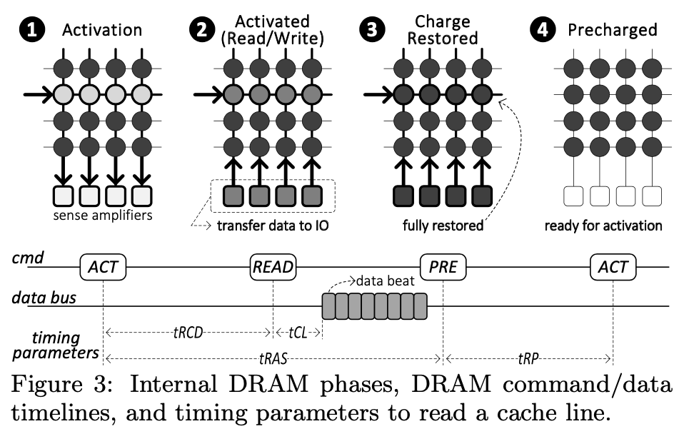

# Haowen Liu  2020-10-22

# Paper information

- Title: Understanding Latency Variation in Modern DRAM Chips: Experimental Characterization, Analysis, and Optimization
- Authors: Kevin K. Chang, Abhijith Kashyap, Hasan Hassan, Saugata Ghose, Kevin Hsieh, Donghyuk Lee, Tianshi Li, Gennady Pekhimenko, Samira Khan, Onur Mutlu
- Venue: SIGMETRICS 2016
- Keywords: DRAM performance, latency variation, memory performance optimization

# Paper content

## Summary
This paper experimentally characterizes and understands the latency variation across cells within a DRAM chip for three fundamental DRAM operations (`activation`, `precharge`, `restoration`), and develops new mechanisms that exploit the latency variation to reliably improve performance.

The experiments are carried across a total of 30 __DDR3__ DRAM modules comprising 240 DRAM chips from the three major DRAM vendors, on an FPGA-based DRAM testing in- frastructure. Here are some important conclusions.

- There is spatial locality in inherently slower cells: such cells are clustered in certain regions of a DRAM chip.
- Each latency exhibits a different level of impact on the inherently-slower cells.
- Most of the erroneous cache lines have a single-bit error, with only a small fraction of cache lines experiencing more than one bit flip.
- The stored data pattern in cells affects access latency variation

Therefore, the paper proposes _FLY-DRAM_ to exploit these findings to improve performance: (i) categorize the DRAM cells into fast and slow regions, (ii) expose this information to the memory controller, (iii) access the fast regions with a lower latency. The simulation-based analysis on the mechanism shows a good result. An idea of a DRAM-aware page allocator that places more frequently-accessed pages into lower-latency regions in DRAM is also discusses.

It is promising to understand and exploit the inherent latency variation within modern DRAM chips, which will improve system performance and perhaps reliability.

## Strengths

- Concise and easy to understand experimental pseudocode.
- Push process forward by questions, making the main line clearer.
- Targeted and selective experiments. The paper first carries out some preliminary experiments to find the suitable and efficient experimental parameter range, and then continue experiments only in this range, avoiding invalid experiments and making the experiment more efficient.
- Show the chart selectively, making the conclusion more obvious and the paper more concise.

## Weaknesses

- Only carried out experiments on old DDR3 chips.
- Unrealistic mechanism.
  - It must take a huge amount of time to investigate the latency variation in a DRAM chip, for it takes 1300 hours in similar experiments. And latency variations in different chips are distinctive, so one should do the investigation on every chip. And the latency variation in one chip may change with time, making it more difficult.
  - No latency margin, unreliable. After all, most of “waste latency” in contemporary DRAM are because of margin.
  - Looking up and applying latency for every request also induces latencies.
- Flawed simulation, evading the crucial point. Didn’t discuss the overhead of looking up and applying latency for every request.
- Tiger head, snake tail. It's very detailed at the beginning, but too brief from the middle to ending.

## Thoughts
- There may be correlation between latency variation and DRAM generation. So we can carry out similar experiments on across different generations to characterize the correlation.
- The latency variation in one chip may change with time, so experiments should also be carried out to characterize it.

## Takeaways and questions

It’s not a new idea to characterize and exploit latency variation in DRAM, and the proposed mechanism is also not outstanding. The advantage of this paper is it has the resources and time to carry out the experiments.

The most important knowledge I learn is the DRAM accessing mechanism: (i) Row Activation & Sense Amplification: opening a row to transfer its data to the row buffer, (ii) Read/Write: accessing the target column in the row buffer, and (iii) Precharge: closing the row and the row buffer.

Here I have some questions.

- Why use WS (weighted speedup) to evaluate the performance in simulation? Is this the convention of computer architecture research?
- Does newer DRAM chip have longer latency?
